## 깃허브 활용하기

### Github에 코드 커밋하기

포크를 통해 프로젝트도 가져왔고, 필요한 코드까지 모두 수정하였습니다.

그렇다면, 어떻게 수정사항을 Github에 반영할 수 있을까요?

정답은 "커밋"입니다.

이 섹션에서는 Github에 코드를 커밋하는 방법을 설명합니다.

<b> 경고 : 해당 문서는 자신의 개인 PC에서 커밋한다는것을 가정으로 합니다. 개인 정보의 유출을 최소화하기 위해, 가능하면 커밋 및 푸시는 공용 PC에서 하지 않는것을 추천합니다. 만약 수행했다면, [아래의 가이드](https://github.com/java-lesson-cbnu-2023/quickstart/blob/main/parts/extra_github/commit/intellij/README.md#%EA%B9%83%ED%97%88%EB%B8%8C-%EC%97%B0%EB%8F%99-ide%EC%97%90%EC%84%9C-%EC%A0%9C%EA%B1%B0%ED%95%98%EA%B8%B0)를 통해 Github 연동을 현재 PC에서 제거하세요.</b>

#### 프로젝트에 원격 레포지토리 할당하기

<b> 경고 : 해당 섹션은 현재 IntelliJ 프로젝트에 Git이 할당되지 않았을 때 수행해야 하는 단계입니다. 만약 왼쪽 바로가기 창에 Commit 혹은 커밋이라는 탭이 존재할 경우, 아래 섹션으로 건너뛰세요.</b>

1. IntelliJ의 툴바에서 VCS를 누릅니다.  
    

2. `Enable Version Control Integration`을 누릅니다.  
   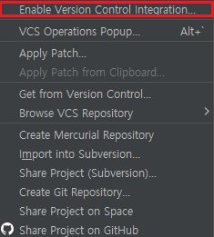 

3. Git을 선택하고, OK를 누릅니다.  
    

4. 프로젝트에 Git이 할당되었다면, VCS가 Git으로 바뀝니다. 
    

5. 코드를 커밋하려면 코드를 저장할 대상을 지정해야 합니다. 툴바에서 `Git > Manage Remotes...`를 누릅니다. 
   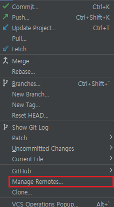 

6. \+ 버튼을 눌러 새 원격 레포지토리를 추가합니다. 여기서 URL은 코드를 업데이트할 대상 레포지토리의 주소입니다. 
   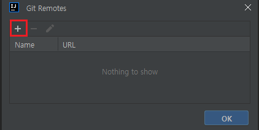 

7. 원격 레포지토리의 URL을 입력하여 커밋할 대상을 지정합니다. 여기서 지정할 URL은 코드를 업데이트할 대상 레포지토리의 주소입니다. 주소를 입력하고 Ok를 누릅니다.  
   따로 다른 목적이 존재하지 않는다면 Name은 origin으로 고정하는것을 추천합니다.  
   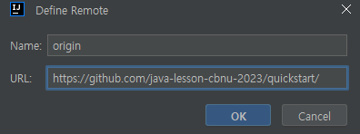 

8. 원격 레포지토리가 추가되었습니다. 이제 코드를 커밋할 준비가 되었습니다. 
    

#### 코드 커밋하기

1. Git이 프로젝트에서 초기화가 완료된 상태에서 커밋할 대상 파일 혹은 클래스가 커밋 목록에 추가되었는지 확인합니다.

2. 만약 커밋할 대상 파일의 이름이 붉은 색이라면, 커밋 목록에 추가되지 않은 상태입니다.  
    
   커밋 목록에 추가하기 위해 파일을 우클릭하고, `Git > Add`를 누릅니다. 
   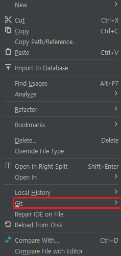
   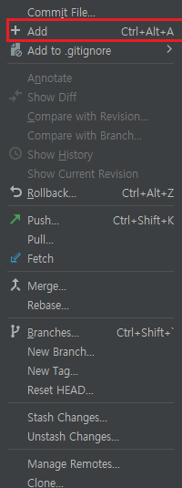 

3. 왼쪽 툴바에서 Commit을 눌러 커밋 창을 열고, Changes 옆에 >를 눌러 커밋 대상 목록을 펼칩니다.  
    

4. 커밋할 대상을 확인하고, 커밋할 파일을 모두 체크합니다.
    

5. 커밋 메시지를 입력하고, Commit을 눌러 커밋을 완료합니다.
   커밋 메시지를 작성하는 방법을 모른다면, 해당 문서에서 사용하는 [Conversational Commit Message](https://www.conventionalcommits.org/ko/v1.0.0/)를 참고해보세요. 
   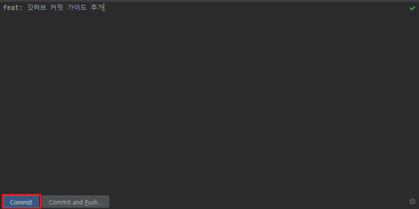 

6. 커밋이 완료되었습니다. 이제 코드를 원격 레포지토리에 업로드할 차례입니다. 위쪽 툴바에서 `Git > Push`를 누르고, Push 버튼을 누릅니다.  
    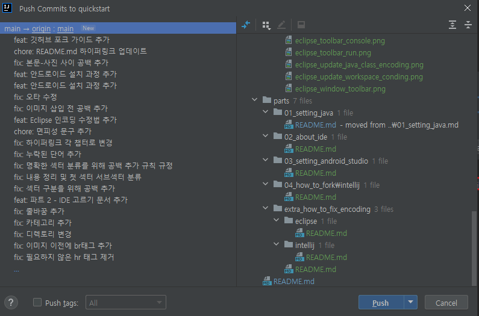 

7. Github에서 로그인을 요청하는 메시지가 뜰 수 있습니다. 이 경우, 창에 띄워진 내용을 따라 로그인을 시도합니다.

8. 로그인이 완료되면, 코드가 원격 레포지토리에 업로드됩니다. 커밋 및 푸시를 완료하였습니다.

#### 깃허브 연동 IDE에서 제거하기

1. 상단 툴바에서 `File > Settings`를 누릅니다.  
   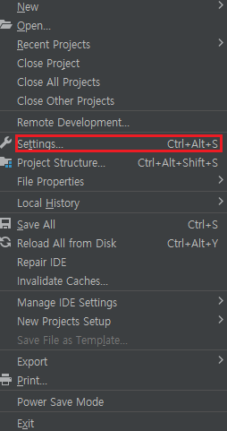 

2. 검색 창에 Github를 입력하고, Github 탭으로 이동합니다.
    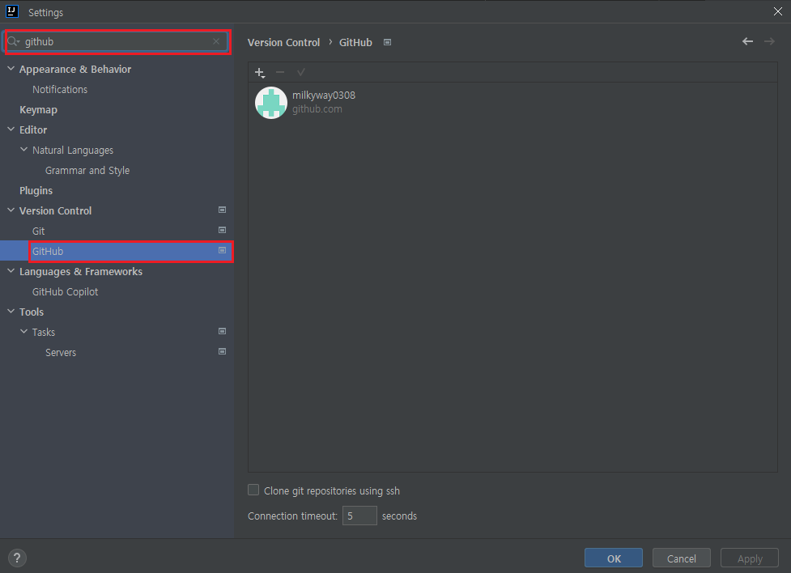 

3. 대상 계정을 선택하고, `-` 버튼을 눌러 연동된 계정을 제거합니다.
    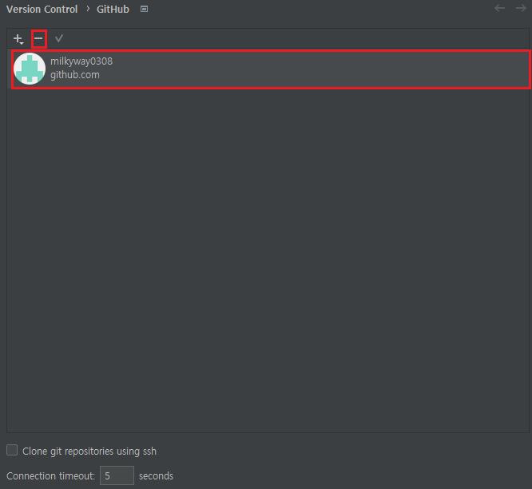 
